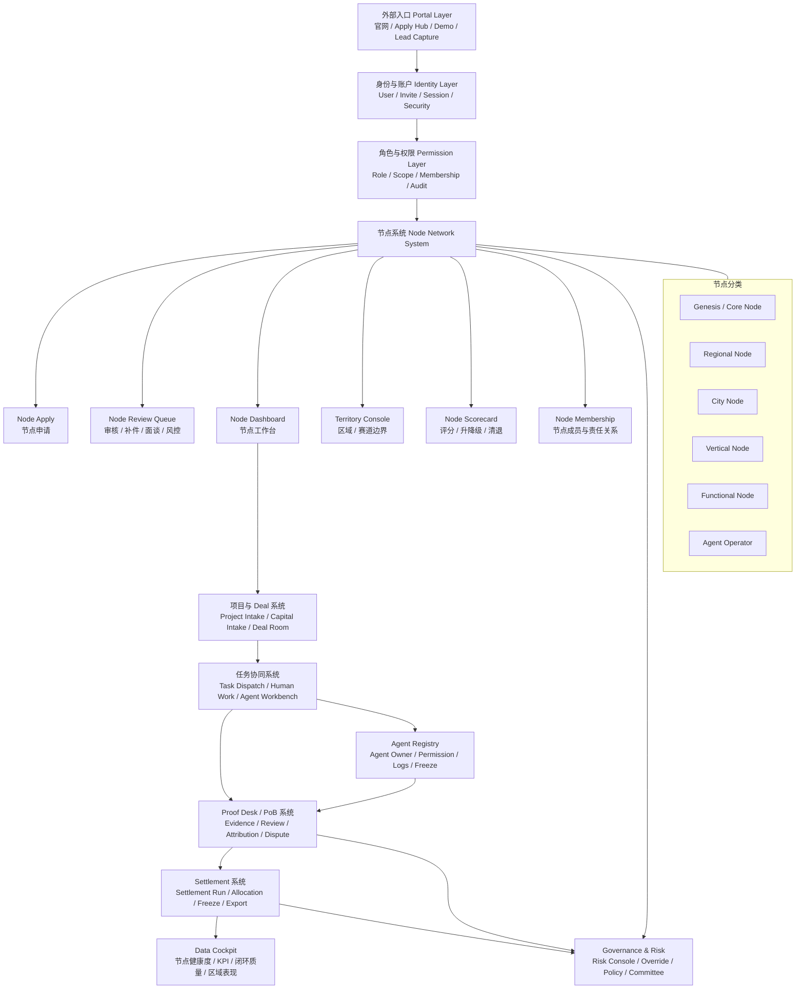
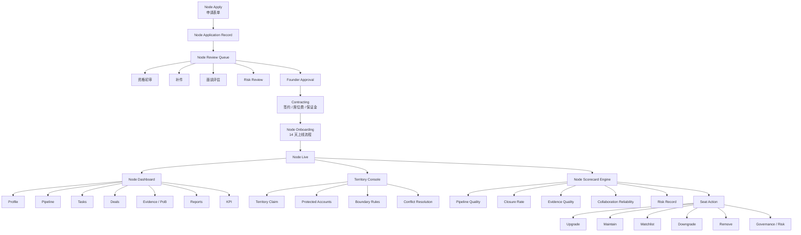
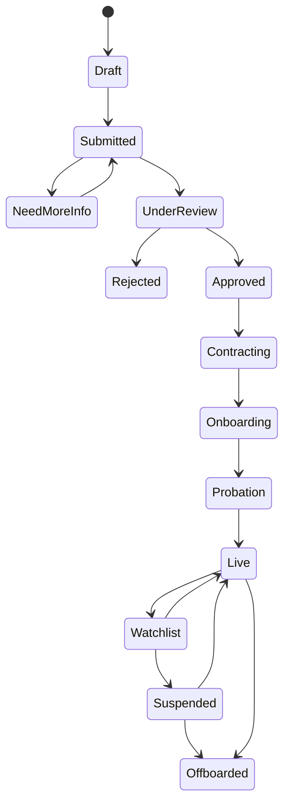
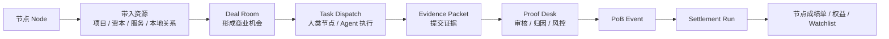
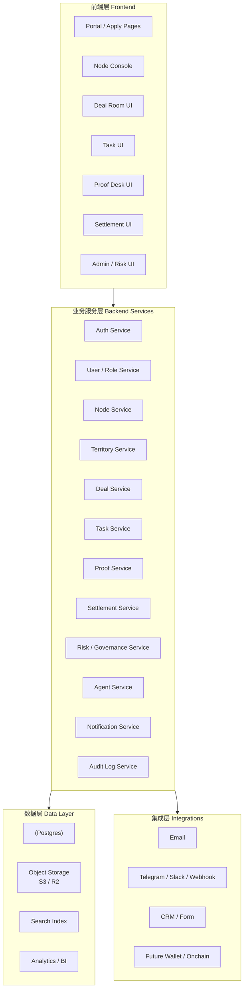
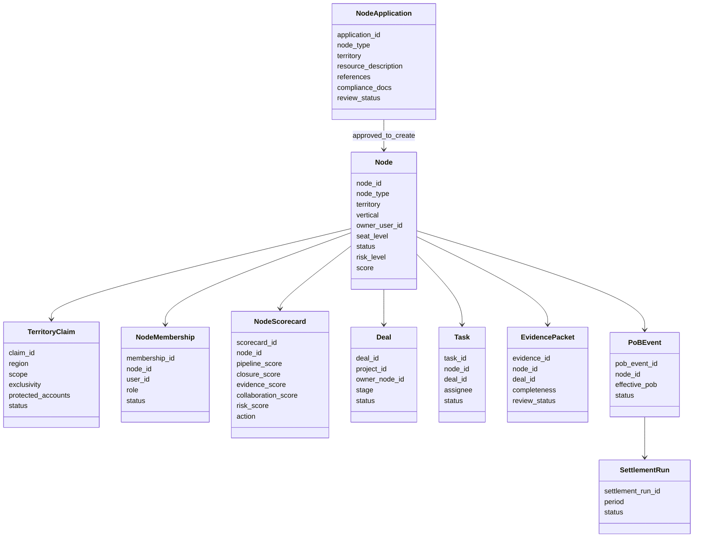
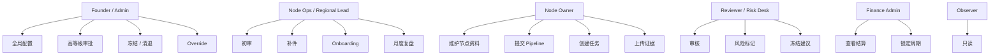

# Node Network System PRD v1.0

> **Status:** v1.0 baseline | **Layer:** WCN 组织中枢（Layer 1）  
> **Audience:** 产品、研发、设计、投资人  
> **Related:** [PRD-02 Node Management (legacy draft)](./02-node-management-system.md) · [Node system architecture](../architecture/node-system.md)

---

## 一、系统定位

节点系统是 WCN 的**核心组织系统（Layer 1）**，负责把「资源关系」转化为：

- 可审核的节点
- 可协同的责任单元
- 可结算的贡献主体
- 可治理的网络结构

**节点不是会员，不是标签**，是承担 **资源 → 闭环 → 证据 → PoB → 结算** 责任的最小运营单元。

---

## 二、系统目标（P0）

1. 建立全球节点池（Genesis 100）
2. 标准化节点准入与审核
3. 让节点进入 Deal / Task / Proof 流程
4. 建立节点评分与淘汰机制
5. 为 PoB 和记账提供责任主体

---

## 三、节点分类体系

### 3.1 节点类型（Node Type）

| 类型 | 定义 | 核心职责 |
|------|------|----------|
| Genesis / Core | 创世核心节点 | 起盘、重大资源 |
| Regional | 区域节点 | 本地资源整合 |
| City | 城市节点 | 本地项目/活动 |
| Vertical | 行业节点 | 专业筛选 |
| Functional | 功能节点 | 服务交付 |
| Agent Operator | Agent 节点 | Agent 执行 |

> **实现映射说明：** 当前代码库 Prisma `NodeType` 使用 `GLOBAL`, `REGION`, `CITY`, `INDUSTRY`, `FUNCTIONAL`, `AGENT` 等枚举；与上表语义对齐时需在产品层约定命名对照（如 GLOBAL ≈ Genesis/Core，INDUSTRY ≈ Vertical）。

### 3.2 节点维度结构（必须字段）

```text
Node:
  node_id
  node_type
  territory
  vertical
  owner_user_id
  legal_entity
  seat_level
  status
  risk_level
  score
```

### 3.3 Territory 模型

```text
Territory:
  region: Singapore / HK / UAE
  scope: Country / City / Vertical
  exclusivity: None / Conditional
  protected_accounts: []
```

---

## 四、核心模块设计

### 4.1 Node Apply（节点申请）

**功能**

- 外部节点申请入口

**字段（NodeApplication）**

- name, type, territory, contact, entity_info, resource_description, past_cases, references, boundary_statement, compliance_docs

**状态机**

`Draft → Submitted → Need Info → Under Review → Approved / Rejected → Contracting`

### 4.2 Node Review Queue（审核台）

**功能**

- 初审 / 面谈 / 风控 / Founder 审批

**动作**

- approve, reject, request_more_info, escalate_to_founder, escalate_to_risk

### 4.3 Node Dashboard（节点工作台）

节点登录后的核心页面，展示：

- Node Profile
- Pipeline
- Tasks
- Deals
- PoB
- KPI
- Risk status

### 4.4 Territory Console（边界管理）

**功能**

- 区域划分
- protected accounts
- 节点冲突处理
- 排他规则

**关键规则**

- Territory ≠ 自动独占
- 必须绑定 KPI 才能独占
- 跨区域必须走系统协同

### 4.5 Scorecard（节点评分）

| 维度 | 说明 |
|------|------|
| Pipeline 质量 | 资源真实度 |
| 闭环率 | 转化能力 |
| 证据质量 | PoB 质量 |
| 协作能力 | 响应速度 |
| 风控记录 | 是否违规 |

**输出（Scorecard）**

- score_total
- status: Upgrade / Maintain / Watchlist / Downgrade / Remove

---

## 五、节点核心流程

### 5.1 准入流程

`Apply → 初审 → 面谈 → 风控 → Founder 批准 → 合同 → 上线`

### 5.2 Onboarding（14 天）

| 阶段 | 内容 |
|------|------|
| Day 1–3 | 建档 + 权限 |
| Day 4–7 | 提交 pipeline |
| Day 8–10 | 参与协同 |
| Day 11–14 | 首个业务推进 |

### 5.3 日常运行

- **周：** 更新任务 / pipeline  
- **月：** 提交报告 / PoB  
- **季：** 评分 + 升降级  

### 5.4 升级机制

**条件：** 多周期有效 PoB、高质量闭环、协作稳定  

**动作：** Upgrade / Maintain / Watchlist / Downgrade / Remove  

---

## 六、节点状态机

### 6.1 节点状态（运营）

`Probation → Live → Watchlist → Suspended → Offboarded`

（准入前阶段另见 4.1 / 架构图：Draft → … → Contracting → Onboarding → Probation → Live 等。）

### 6.2 席位动作

Upgrade / Maintain / Watch / Downgrade / Remove  

---

## 七、权限设计

### 7.1 角色

| 角色 | 权限 |
|------|------|
| Founder | 全局控制 |
| Node Ops | 审核 |
| Node Owner | 管理节点 |
| Reviewer | 审核证据 |
| Risk Desk | 风控 |
| Finance | 结算 |
| Observer | 只读 |

### 7.2 权限规则

- 禁止自审
- 禁止越权导出
- 禁止修改结算
- 高风险需双签

---

## 八、与其他系统关系

节点系统必须连接：

- Portal（入口）
- Identity（身份）
- Deal Room（业务）
- Task（执行）
- Proof Desk（验证）
- Settlement（结算）
- Governance（风控）

节点是整个系统的**责任锚点**。

---

## 九、数据对象关系

```text
Node
 ├── NodeApplication
 ├── Territory
 ├── Membership
 ├── Pipeline
 ├── Task
 ├── Deal
 ├── Evidence
 ├── PoB
 ├── Settlement
 └── Scorecard
```

---

## 十、P0 / P1 / P2 开发范围

| 阶段 | 范围 |
|------|------|
| **P0** | Node Apply；Node Review；Dashboard；Scorecard；Territory 基础；与 Deal/Task/Proof 打通 |
| **P1** | 跨节点协同；Territory 冲突处理；节点委员会；分润结构 |
| **P2** | 链上节点身份；节点质押；节点治理 |

---

## 十一、验收标准

系统必须做到：

1. 节点 14 天内可上线  
2. 每个节点有清晰责任  
3. 节点进入 Deal → Task → Proof 闭环  
4. 有评分与淘汰机制  
5. 所有行为可审计  

---

## 十二、核心原则

1. **节点不是「谁都可以进」** — 只允许能带来资源的人  
2. **节点必须有责任** — 带资源、推闭环、提证据  
3. **节点必须被淘汰** — 没有贡献必须清退  
4. **节点必须进入结算系统** — 否则就是社群  

---

## 十三、一句话总结

**节点系统 = 资源入口 + 责任绑定 + 闭环执行 + 证据归因 + 价值分配**

---

## 附录 A — WCN 节点系统总架构图



---

## 附录 B — 节点系统内部架构图



---

## 附录 C — 节点生命周期（状态图）



---

## 附录 D — 节点与主业务闭环



---

## 附录 E — 工程分层（研发口径）



---

## 附录 F — 核心数据关系（类图）



---

## 附录 G — 权限架构图



---

## 附录 H — 研发实施顺序（建议 Waves）

| Wave | 内容 |
|------|------|
| **Wave 1** | Node Apply；Node Review；Role / Permission；Basic Dashboard |
| **Wave 2** | Territory Console；Membership；Scorecard；Pipeline |
| **Wave 3** | 打通 Deal / Task / Proof |
| **Wave 4** | 打通 Settlement / Governance / Risk |

---

## 附录 I — 分层交付口径（可直接拆 Epic）

1. **展示层：** Node Apply；Node Review Queue；Node Dashboard；Territory Console；Scorecard & Review  
2. **业务层：** Node Service；Territory Service；Membership Service；Score Engine；Lifecycle Engine  
3. **审计与治理层：** Risk Engine；Approval Engine；Audit Log；Override Log  
4. **结算联动层：** Deal Linker；Task Linker；Proof Linker；Settlement Linker  

---

## 最重要的一句话

节点系统不是「招募页面」，而是 **WCN 的组织操作系统**：把外部资源拥有者，变成系统里有边界、有任务、有证据、有评分、有结算、有清退机制的**责任主体**。
